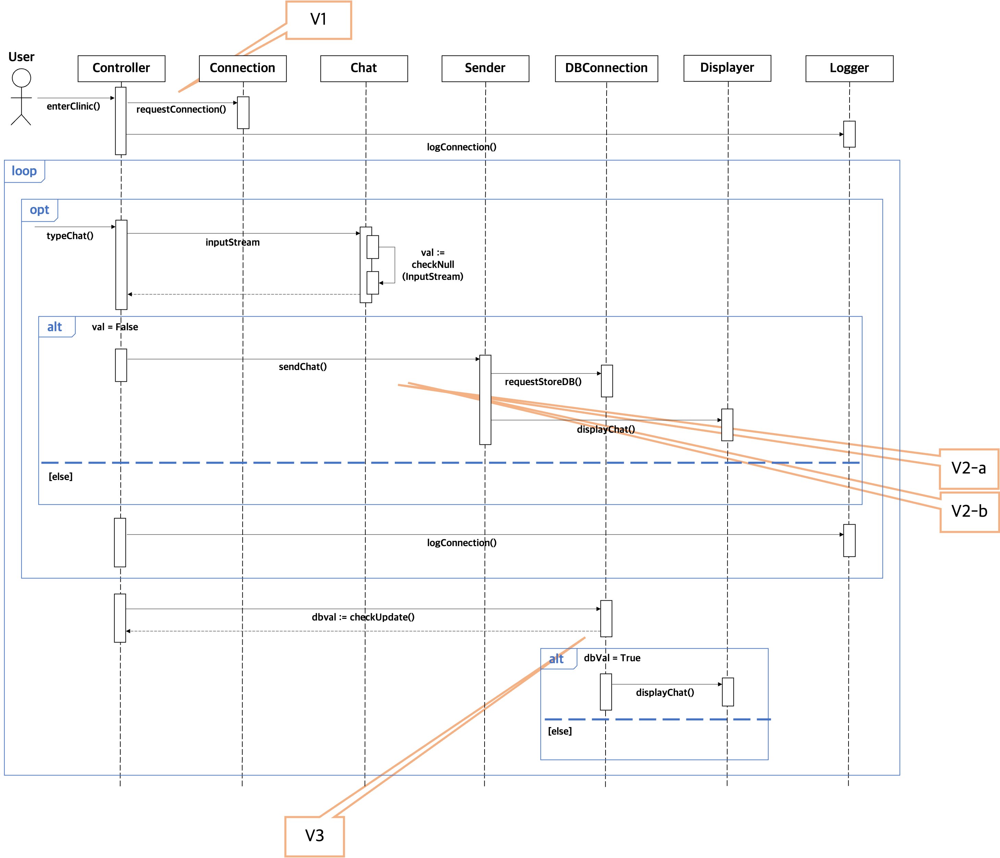

# Object Sequence Diagram

### - Object Sequence Diagram for UC-1 : Clinic  
- Notion : [Link](https://www.notion.so/Sequence-Class-Diagram-for-UC-1-2fdc0b0c38e84df39169ff9cc20e937e)  

### - Object Sequence Diagram for UC-4 : Search Disease  
- Notion : [Link](https://www.notion.so/Sequence-Diagram-for-UC-4-9d4e065dabd34de098335d90682d72a2)  

### - Object Sequence Diagram for UC-10 : Disease Management  
- Notion : [Link](https://www.notion.so/Sequence-Class-Diagram-for-UC-10-7d34f52f07cc48fea78291fbd0135cfd)

